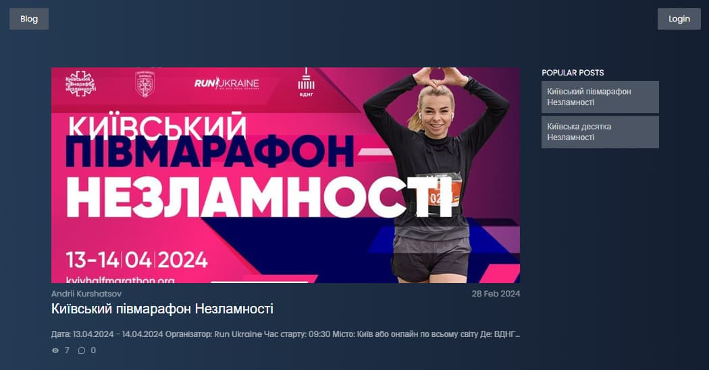
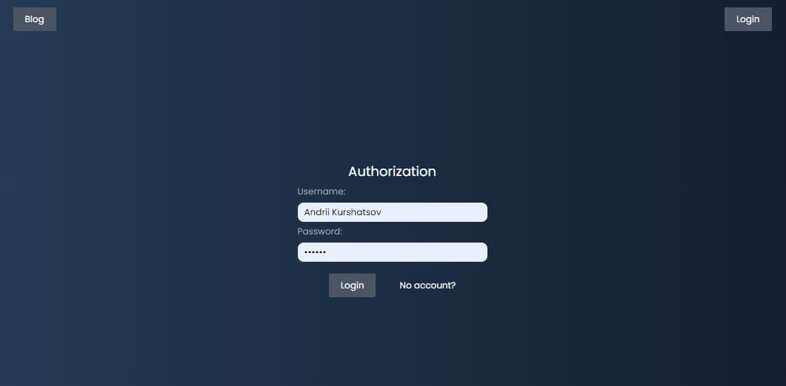
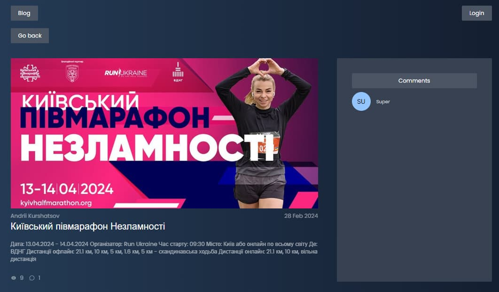

## Sport Blog Application

This is a simple blog application developed as a sport blog project.

## Overview

The application consists of 4 public pages:

1. Home Page: Provides an overview of all sporting events posted by users.

2. Registration Page: User registration page.

3. Login Page: User authorization page.

4. Post Page: Individual post page with description and comments.

The application consists of 3 private pages:

1. Home Page: Provides an overview of all sporting events posted by users.

2. My Posts Page: Page of posted posts by logged in user.

3. Add Post Page: Page for adding a post by a logged in user.

## Features

- The user can add a picture, title and description of the sports event.

- The user can change the picture, title and description of the sports event.

- The user can delete a sports event.

- The user can see how many times a sports event has been viewed and go to a specific event from the sidebar - popular posts.

- A logged-in user can add a comment to a sports post.

## Technical Requirements

- The application is built with React.
- Routing is implemented using React Router.
- User data and his posts are placed in the database MongoDB.
- User actions are preserved even after page refresh.

## Non-Existent Route

- If a user accesses a route that does not exist, they will be redirected to the home page.

## Technologies

- React
- Redux
- React Router
- Axios (for API requests)

## API

The application utilizes a backend developed by Andrii Kurshatsov. Feel free to familiarize yourself with it
[here](https://github.com/kurshatsov-andrii/blog-back-end)

## Redux State

The Redux store manages the application's state, encompassing tokens, user and event information.

## Authors

- Created by Andrii Kurshatsov
